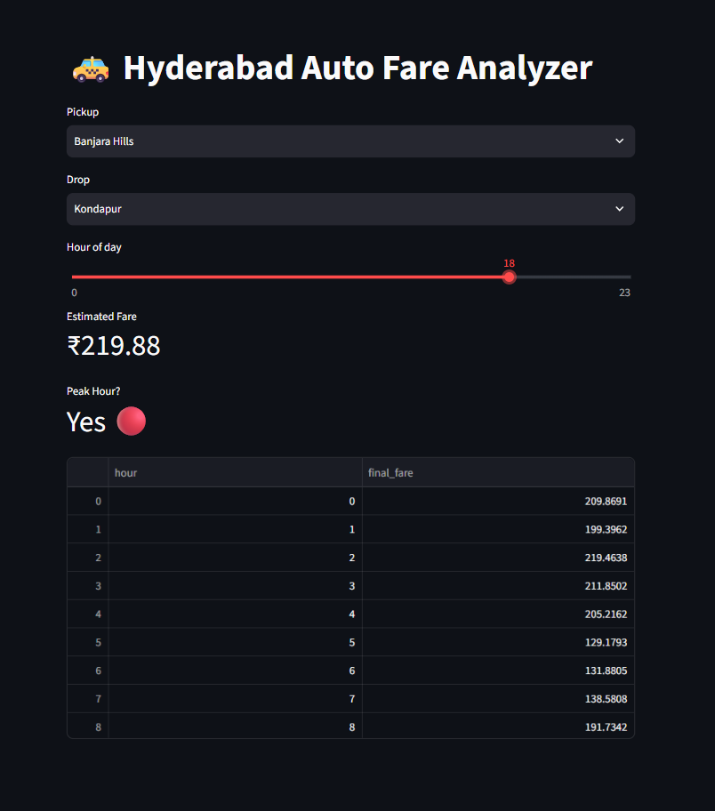
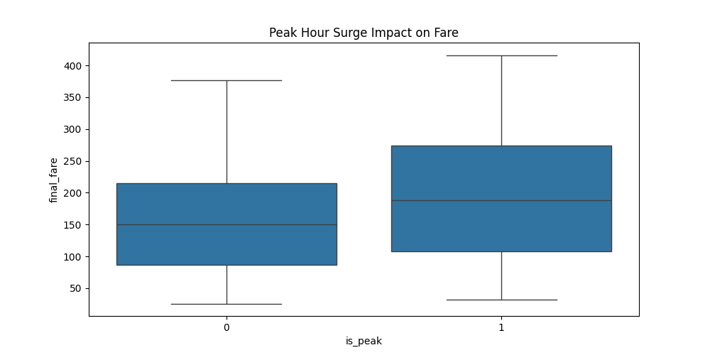
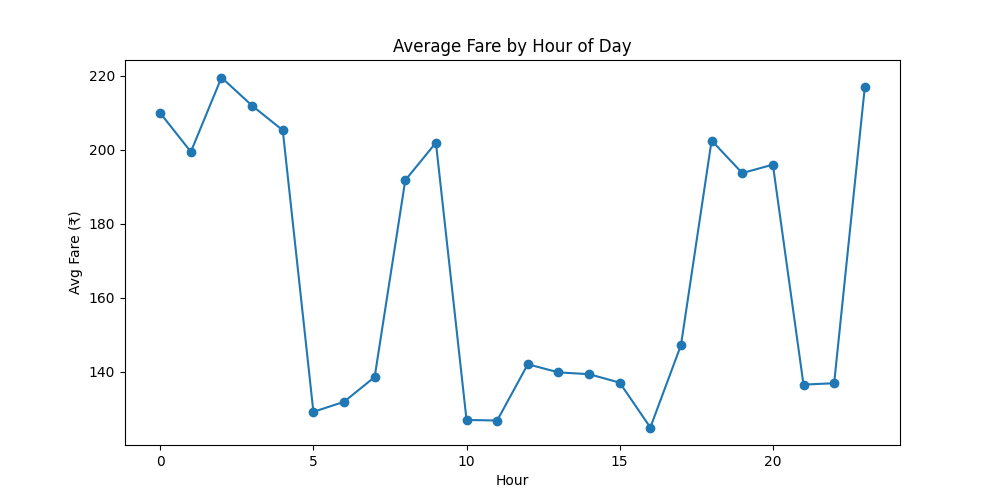

# 🛺 Hyderabad Auto Fare Analyzer

Exploratory data analysis of auto-rickshaw fares in Hyderabad, with an interactive Streamlit app that estimates the fare for a trip.

## 📌 Data

`hyderabad_auto_fares.csv` contains the auto fare data used in this project.

## ⚙️ Approach

- Explored and analysed the fare data (EDA) in Python
- Looked at how fares change across the hours of the day, including peak hours
- Built a Streamlit app (`app.py`) so anyone can try it

## 🚀 App Features

- Choose a **pickup** and a **drop** location
- Pick the **hour of the day** with a slider (0 to 23)
- See the **estimated fare** for that trip
- See whether the chosen hour is a **peak hour**
- View a table of the fare at every hour of the day

## 🛠️ Tech Stack

- Python
- pandas
- Streamlit

## 📷 Screenshots

### Streamlit App


### Peak Hour Surge Analysis


### Hourly Fare Trend


## ▶️ Run it locally

```bash
git clone https://github.com/Huzefkhan1/hyderabad-auto-fare-analyzer.git
cd hyderabad-auto-fare-analyzer
pip install streamlit pandas
streamlit run app.py
```

## 🔗 Author

**Huzef Khan** | Aspiring Data Analyst, Hyderabad

- Portfolio: [huzefkhan1.github.io](https://huzefkhan1.github.io)
- GitHub: [Huzefkhan1](https://github.com/Huzefkhan1)
- LinkedIn: [Huzef Khan](https://www.linkedin.com/in/huzef-khan-b1278433b)
- Email: huzefk837@gmail.com
